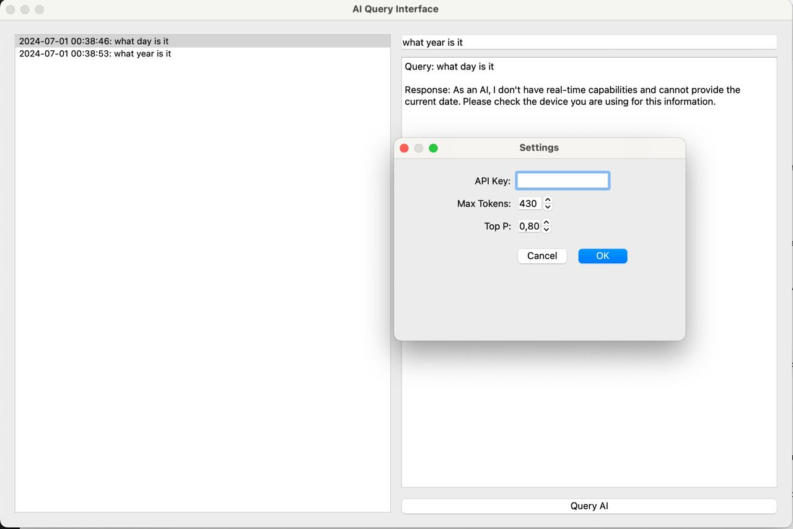

# chatai

a currently simple python/UI to interact with OpenAI ChatGPT API.

I use chatgpt4 about 3 times per waking hour via the web interface. However I am missing some functionality from the browser interface: bookmarking of conversations, better search of conversations. Also recently the UI defaults to the weak gpt3.5 model which I find an annoying "feature". I have experimented with a UI for chatgpt before, this is a new attempt with python/QT.

potential advanced features: 
* integrate claude
* integrate more deeply with file system and coding
* memory and OS usage

chatgpt UI

```
poetry run python chat/chatui.py
```

[](ui.jpeg)

